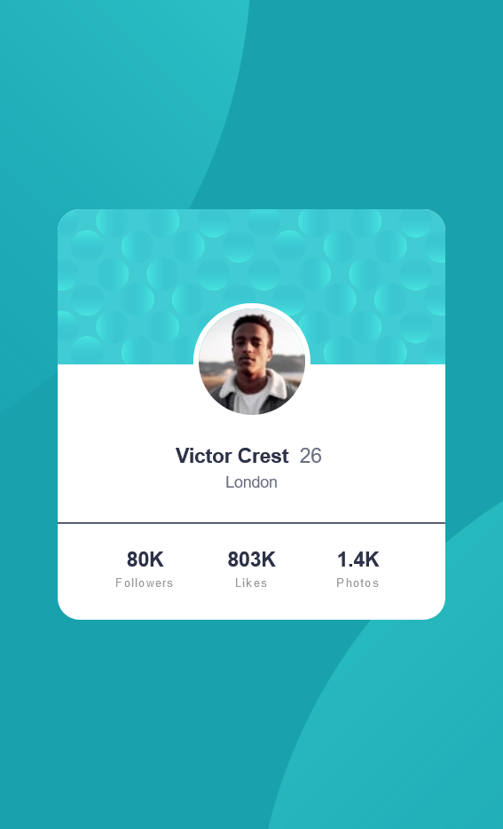

# Frontend Mentor - Profile card component solution

This is a solution to the [Profile card component challenge on Frontend Mentor](https://www.frontendmentor.io/challenges/profile-card-component-cfArpWshJ). Frontend Mentor challenges help you improve your coding skills by building realistic projects. 

## Table of contents

- [Overview](#overview)
  - [The challenge](#the-challenge)
  - [Screenshot](#screenshot)
  - [Links](#links)
- [My process](#my-process)
  - [Built with](#built-with)
  - [What I learned](#what-i-learned)
  - [Continued development](#continued-development)
  - [Useful resources](#useful-resources)
- [Author](#author)


## Overview

### The challenge

- Build out the project to the designs provided

### Screenshot




### Links

- Solution URL: [Add solution URL here](https://your-solution-url.com)
- Live Site URL: [Add live site URL here](https://your-live-site-url.com)

## My process

### Built with

- Semantic HTML5 markup
- CSS custom properties
- Flexbox

### What I learned

I have learned how to use felxbox in order to center a container and elements within that container.

```css
body {
    background: hsl(185, 75%, 39%);
    height: 100vh;
    display: flex;
    justify-content: center;
    align-items: center;
}
```

### Continued development

In the future I intend on learning more about flexbox and how to make a website responsive. Also I want to get more familiar with css units.

### Useful resources

- [Resource 1](https://flexbox.help) - This helped me understand flexbox. I really liked this pattern and will use it going forward.

## Author

- Frontend Mentor - [@airdgo](https://www.frontendmentor.io/profile/airdgo)